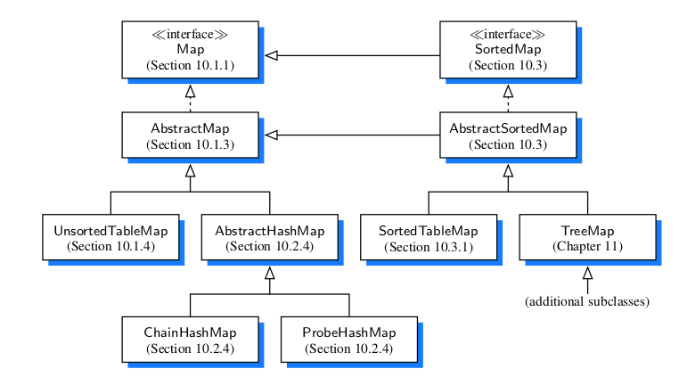

# Maps

A map is an abstract data typ designed to effcientlry store and retrieve values based upon a uniquely identifying ***search key*** for each. Specifically, a map stores key-value pairs (k, v), which we call entries, where k is the key and v is its corresponding value. Keys are required to be unique, so that the association of keys to values defines a mapping. 
Maps are also known as associative arrays, because the entry's key serves somewhat like an index into the map, in that it assists the map in effciently locating the associated entry.

### The Map ADT
since  a map stores a collection of objects, it should be viewed as a collection of key-value pairs. As an ADT, a map M supports the following methods:

- size()
- isEmpty()
- get(k)
- put(k, v)
- remove(k)
- keySet()
- values()
- entrySet()

### A Java Interface for the Map ADT

~~~
public interface Map<K,V> {
  int size();
  boolean isEmpty();
  V get(K key);
  v put(K key, V value);
  V remove(K key);
  Iterable<K> keySet();
  Iterable<V> values();
  Iterable<Entry<K, V>> entrySet();
}
~~~

### An AbstractMap Base Class

Data Structures and Algorithms in Java by Michael T. Goodrich and Roberto Tamassia. [^resource]
[^resource]: p406

## Hash Tables

We introduce *Hash Table* that is one of most efficient data structures for implementing a map, and the one that is used most in practice.

Intuitively, a map *M* supports the abstraction of using key as "addresses" that help loctae an entry.  

Usually we store a value associated with key k at index k of the table. for instance (1,D), (3,Z), (4,B)
Basic map operations get, put, and remove can be implemented in **O(1)** worst-case time.

There are two challenges in extending this framework to the more general setting of a map. First, we may not wish to devote an array of length N if it is the case that N >> n. Second, we do not in general require that a map's keys be integers. The novel concept for a hash table is the use of a hash function to map general keys to corresponding indices in a table.
We will conceptualize our table as a **bucket array**, as

