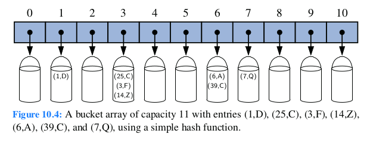
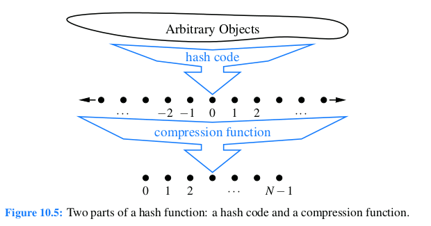

## Hash Tables

We introduce *Hash Table* that is one of most efficient data structures for implementing a map, and the one that is used most in practice.

Intuitively, a map *M* supports the abstraction of using key as "addresses" that help loctae an entry.  

Usually we store a value associated with key k at index k of the table. for instance (1,D), (3,Z), (6,C)
Basic map operations get, put, and remove can be implemented in **O(1)** worst-case time.

There are two challenges in extending this framework to the more general setting of a map. First, we may not wish to devote an array of length N if it is the case that N >> n. Second, we do not in general require that a map's keys be integers. The novel concept for a hash table is the use of a **hash function** to map general keys to corresponding indices in a table.
We will conceptualize our table as a **bucket array**

Data Structures and Algorithms in Java by Michael T. Goodrich and Roberto Tamassia. [^resource]
[^resource]: p410 of this book

## Hash Functions

The goal of a hash function, h, is to map each key k to an integer in the range [0,N-1], where N is the capacity of the bucket array for a hash table. Equipped with such a hash function, h, the main idea of this approach is to use the hash function value, *h(k)*, as an index into our bucket array, A, instead of the key k (which may not be appropriate for direcdt use as an index). That is, we store the entry(k,v) in the bucket A[h(k)].

If there are two or more keys with the hash value, then two different entries will be mapped to the same bucket in A. In this case, we say that a collision has occurred. To be sure, there are ways of dealing with collision, which we will discuss later, but the best strategy is to try to avoid them in the first place.

It is common to view the evaluation of a has function, h(k), as consisting of two portions-a 
 **hash code** that maps a key k to an integer, and a **compression function** that maps the hash code to an integer within a range of indices, [0,N-1], for a bucket array. 

 
 Data Structures and Algorithms in Java by Michael T. Goodrich and Roberto Tamassia. [^resource2]
[^resource2]: p411 of this book

### Hash Codes

The first action that a hash function perform is to take an arbitary key k in our map and compute an integer that is called the **hash code** for k; this integer need not be in the 